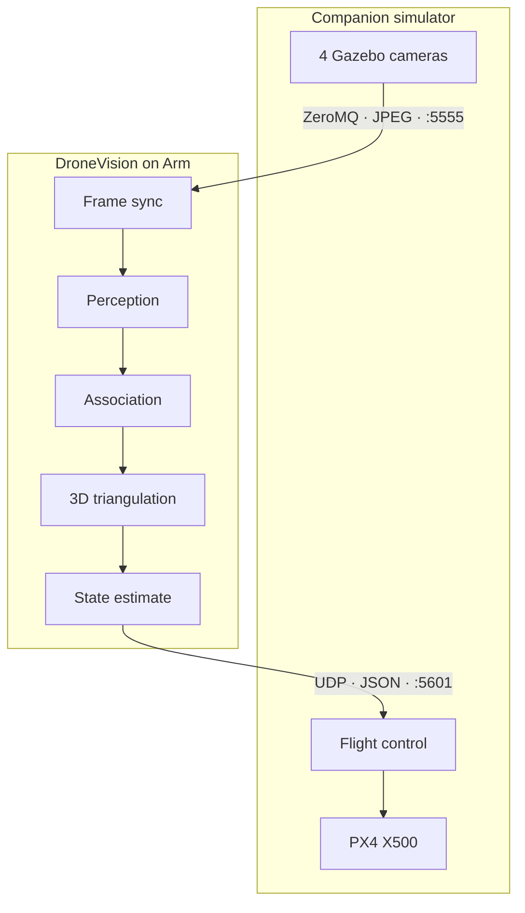

# System architecture

## Two repositories, one flight loop

The solution deliberately separates the reusable AI block from its test environment. They share network contracts, not source code or a filesystem.



### Repository boundaries

| Responsibility | `dronevision-ai` | `Hackathon_ARM_Simulator` |
|---|:---:|:---:|
| Portable localization library | ✓ | — |
| Recorded corpus and benchmarks | ✓ | — |
| Gazebo world and fixed cameras | — | ✓ |
| PX4 SITL and external-vision injection | — | ✓ |
| Model training and synthetic data generation | — | ✓ |
| Live frame/state services | Protocol consumer | Protocol provider |

The central design rule is enforced by tests: nothing under `dronevision/` imports Gazebo, ROS, PX4 or MAVLink. This keeps the install small enough for a bare Raspberry Pi or embedded Linux board.

## The package is the diagram

The directories carry their processing order so code navigation matches the data flow:

```text
dronevision/
├── l1_image_sync/      frame sets, freshness and camera selection
├── l2_perception/      colour, motion, hybrid and YOLO detectors
├── l3_association/     per-camera tracking and observation selection
├── l4_triangulation/   calibrated multi-view DLT and consensus
├── l5_estimation/      temporal smoothing and estimate freshness
├── io/                 replay, network sources and output schema
├── pipeline.py         the five-stage composition root
└── service.py          long-running process boundary
```

`tests/test_boundary.py` verifies the declared layers, rejects a hidden sixth stage and prevents an earlier layer from importing a later one.

## Interfaces at the boundary

### Frames in

The simulator publishes four JPEG images and synchronized metadata over ZeroMQ. The production representation uses JPEG quality 90: the recorded evidence shows approximately **6 Mbit/s instead of 442 Mbit/s raw**, with no meaningful loss in localization accuracy on the corpus.

### State out

DroneVision emits a transport-neutral JSON state estimate over UDP. The companion project converts it to `VISION_POSITION_ESTIMATE` for PX4 EKF2. Real hardware can replace either service without modifying the five AI layers.

## Where estimation belongs

Layer 5 currently uses an exponential moving average. An EKF3D scaffold exists but is intentionally not wired into the live path: PX4 already fuses external position with inertial data in EKF2. The edge block owes the controller a smooth, outlier-free and freshness-aware position—not a duplicate flight estimator.
