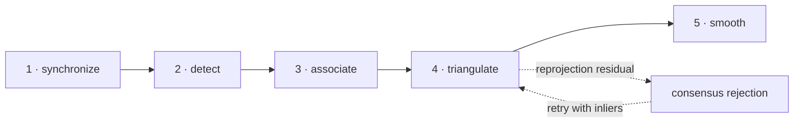

# Vision pipeline

## From pixels to a position fix

## 1. Image synchronization

A position fix is built from a set of camera observations, not from an arbitrary group of latest frames. The recorded live system measured a 39 ms mean camera skew. Frames older than the configured `max_age` are reported as absent and recover automatically when the stream returns.

This rule came from a dangerous failure mode: when a camera service died, an earlier implementation emitted a confident frozen position indefinitely. A stale image is now treated as worse than no image.

## 2. Perception

The detector is interchangeable without changing the geometric stages:

| Detector | Role | Strength | Limitation |
|---|---|---|---|
| `color` | Reference and fallback | Fast, deterministic and **6.28 mm mean** on the committed corpus | Requires a visible marker and correct offset calibration |
| `yolo` | Learned Arm workload | Detects the drone by shape | Dominates compute cost |
| `motion` | Cheap candidate generator | Suppresses static background | Cannot detect a stationary hover alone |
| `hybrid` | Motion ROI → YOLO | Reduces the searched area | Requires tracking and motion-aware scheduling |

The deployed YOLO26n v4 model reaches **0.994 mAP50** on a clean synthetic benchmark whose validation room was not seen during training. The model artifact used for cross-board measurements is fixed by SHA-256.

## 3. Association and coasting

Each camera produces zero or more candidates. The current single-target associator selects a coherent observation and maintains a per-camera Kalman state so short detector misses do not immediately destroy the four-view set. Multi-target identity is intentionally outside the current project scope.

## 4. Consensus triangulation

Calibrated projection matrices map each 3D hypothesis back into every image. Direct Linear Transform provides a fast closed-form solution, then reprojection error identifies inconsistent views.

A single-pass rejection strategy failed when one gross outlier had already corrupted the shared solution: it could label good cameras as bad. The production implementation evaluates minimal camera subsets and chooses the consensus with the strongest reprojection support.

The result is graceful degradation:

| Condition | Mean 3D error |
|---|---:|
| All four cameras, offset-audited factory geometry | **6.28 mm** |
| Two opposing cameras occluded | **22.19 mm** |

## 5. Temporal estimate

The final layer smooths accepted positions and exposes freshness. It does not conceal detector misses or invent high-confidence state. PX4 performs the downstream inertial fusion used for flight.

## Calibration matters

The most subtle accuracy errors were not detector errors:

- the simulator pose topic contains model and link entries; one plausible-looking link pose never moves;
- the effective marker offset is 0.4334 m, not the 0.18 m suggested by the model file;
- 85.4% of the room is covered by at least two cameras, leaving single-view dead zones near corners;
- one pixel of detection error corresponds to roughly 2 cm in the interior and 3.5 cm near the edges.

A geometry audit clarified an important dependency: bundle adjustment must compare image detections with the 3D point the detector actually observes. For the colour detector that point is approximately 0.4333 m above vehicle-origin ground truth. Refining against the unshifted vehicle origin lets the optimizer absorb this vertical offset into the camera extrinsics, so reprojection error can improve while the recovered physical calibration becomes less meaningful.

The current `factory.yaml` therefore restores the nominal simulator camera poses, retains the explicit detector offset and requires `--marker-offset` when refining with the colour detector. On the committed corpus this baseline localizes 337/337 sets at **6.28 mm mean**, **6.19 mm median**, **10.87 mm P95** and **14.79 mm maximum** error.

The benchmark toolkit therefore separates geometry auditing, bundle-adjustment refinement and end-to-end accuracy.
