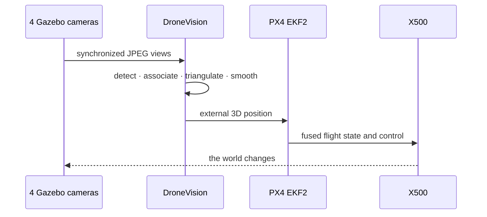

# Simulator and flight demo

## A test bench that can actually fly the output

The companion repository packages Gazebo Harmonic, PX4 SITL and a browser-accessible desktop inside Docker. Its industrial `factory` world contains an X500 quadrotor and four fixed cameras. The system can take off with GPS, switch to camera-derived external vision, disable GPS and remain in flight.



## Run the complete demo

Clone the simulator next to this repository, then:

```bash
cd ../Hackathon_ARM_Simulator
./demo.sh up
./demo.sh fly
./demo.sh status
```

Open the browser interfaces:

- `http://localhost:4000` — Gazebo desktop;
- `http://localhost:8101` — four-camera operator panel.

The first Docker build compiles PX4 and can take 20–40 minutes. GPU acceleration is optional; software rendering works on Linux, macOS and Apple Silicon. The simulation starts headless because the 3D viewer is the dominant cost under CPU rendering.

## Switch perception during flight

```bash
./vision.sh switch --color
./vision.sh switch --yolo
./vision.sh switch --motion
./vision.sh switch --hybrid
```

The detector can change without altering synchronization, triangulation or PX4 injection. This is the practical value of the layered design: a safe baseline can keep the system operational while the learned path is optimized.

## What the simulator proved

- PX4 EKF2 accepts and fuses the external-vision estimate.
- The drone flies with `EKF2_GPS_CTRL=0` and vision as the height reference.
- Robust triangulation remains functional with two of four cameras unavailable.
- Synthetic data generation can randomize industrial textures, illumination, blur, JPEG artifacts, distractors and negative frames.
- The simulation and AI service can run on separate hosts over explicit network protocols.

[:fontawesome-brands-github: Open the simulator repository](https://github.com/SCAI-Engineering/Hackathon_ARM_Simulator){ .md-button .md-button--primary }

